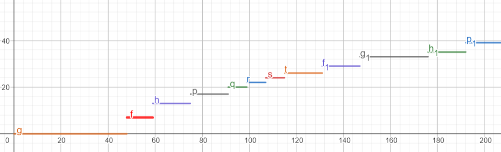

# 0/1 Nahrbtnik

**Ime:** Timen Bobnar

**Datum:** 06.01.2024

**Navodilo:** Oddajte odgovore na prašanja


## Prva naloga
**Navodila:** Izračunajte množico S4

Podatki:
```
       i |  1   2   3   4
vrednost |  6   9   4   7
velikost | 10   7  13   8
```
Rešitev:
```
S0=[(0,0)]
Z1=[(10,6)]
S1=[(0,0),(10,6)]
Z2=[(7,9),(17,15)]
S2=[(0,0),(7,9),(17,15)]
Z3=[(13,4),(20,13),(30,19)]
S3=[(0,0),(7,9),(17,15),(30,19)]
Z4=[(8,7),(15,16),(25,22),(38,26)]
S4=[(0,0),(7,9),(17,15),(25,22),(38,26)]
```
## Druga Naloga
**Navodila:** Odgovori na vprašanja

Podatki:
```
Dani so predmeti:

       i |  1   2   3   4   5   6  7   8
vrednost |  6   9   4   7   6   7  5   9
velikost | 11  40  16  32  45  48  9  44
Z algoritmi smo že izračunali naslednje množice:

S0 = [(0, 0)]
Z1 = [(11, 6)]
S1 = [(0, 0), (11, 6)]
Z2 = [(40, 9), (51, 15)]
S2 = [(0, 0), (11, 6), (40, 9), (51, 15)]
Z3 = [(16, 4), (27, 10), (56, 13), (67, 19)]
S3 = [(0, 0), (11, 6), (27, 10), (51, 15), (67, 19)]
Z4 = [(32, 7), (43, 13), (59, 17), (83, 22), (99, 26)]
S4 = [(0, 0), (11, 6), (27, 10), (43, 13), (51, 15), (59, 17), 
      (67, 19), (83, 22), (99, 26)]
Z5 = [(45, 6), (56, 12), (72, 20), (88, 19), (96, 21), (104, 23), 
      (112, 25), (128, 28), (144, 32)]
S5 = [(0, 0), (11, 6), (27, 10), (43, 13), (51, 15), (59, 17), 
      (67, 19), (83, 22), (99, 26), (128, 28), (144, 32)]
Z6 = [(48, 7), (59, 13), (75, 17), (91, 20), (99, 22), (107, 24),
      (115, 26), (131, 29), (147, 33), (176, 35), (192, 39)]
S6 = [(0, 0), (11, 6), (27, 10), (43, 13), (51, 15), (59, 17),
      (67, 19), (83, 22), (99, 26), (128, 28), (131, 29), (144, 32),
      (147, 33), (176, 35), (192, 39)]
Z7 = [(9, 5), (20, 11), (36, 15), (52, 18), (60, 20), (68, 22),
      (76, 24), (92, 27), (108, 31), (137, 33), (140, 34), (153, 37),
      (156, 38), (185, 40), (201, 44)]
S7 = [(0, 0), (9, 5), (11, 6), (20, 11), (36, 15), (52, 18), (60, 20),
      (68, 22), (76, 24), (92, 27), (108, 31), (137, 33), (140, 34),
      (153, 37), (156, 38), (185, 40), (201, 44)]
Z8 = [(44, 9), (53, 14), (55, 15), (64, 20), (80, 24), (96, 27), (104, 29),
      (112, 31), (120, 33), (136, 36), (152, 40), (181, 42), (184, 43),
      (197, 46), (200, 47), (229, 49), (245, 53)]
S8 = [(0, 0), (9, 5), (11, 6), (20, 11), (36, 15), (52, 18), (60, 20),
      (68, 22), (76, 24), (92, 27), (104, 29), (108, 31), (120, 33), (136, 36),
      (152, 40), (181, 42), (184, 43), (197, 46), (200, 47), (229, 49), (245, 53)]
```

Odgovori:
```
1. Pri prepisu množice Z5 je pri natanko enem paru prišlo do napake. Kateri par je napačen in kakšen bi moral biti? Ali lahko napako ugotovimo, ne da bi ponovno računali Z5?
Do napake pride pri elementu (72,20), saj je drugi člen 20 moral bi biti 16.

2. Če imamo na voljo 160 enot prostora, kakšna je optimalna vrednost nahrbtnika? 
40

3. Koliko neizkoriščenega prostora nam ostane, če optimalno napolnimo nahrbtnik velikosti 110 s prvimi petimi predmeti. Kakšna je ta optimalna vrednost polnitve? Opiši vse možne načine, kako dosežemo to optimalno vrednost! 
Rezultat je (99,26) saj moramo opazovati vrstico S5. Ostane 11 enot prostora. Oprimalna vrednost je torej 26. Tako rešitev dobimo če izberemo [1,1,1,1,0] rečitev.

4.Skiciraj graf funkcije, ki pokaže, kako se v odvisnosti od razpoložljivega prostora spreminja optimalna vrednost nahrbtnika, če imamo na voljo prvih 6 predmetov in 6. predmet moramo dati v nahrbtnik.
```

```
5.Ugotovili smo, da imamo na voljo še en predmet, in sicer velikosti 15 in vrednosti 4 (torej je na voljo 9 predmetov). Kakšna je optimalna vrednost nahrbtnika, ki ima 180 enot prostora? Opiši vse možne načine, kako dosežemo to optimalno vrednost!
Prvi način:
Pogledamo kaj je maksimum za nahrbtnik z volumnom 165 in dobimo 40 sedaj mu prištejemo še dodan element torej z volumnom 15 in vrednostjo 4 torej dobimo skupno vrendost 44. To sedaj primerjamo z optimalno rešitvijo za nahrbnik z volumnom 180, ki pa je 40. Torej se nam splača dodati 9ti element v nahrbtnik.
Drugi način:
Dodamo ta elemen v celi nabor in samo nadaljujemo z algoritmom(to bi naredili tudi če bi dodali več predmetov).
```
